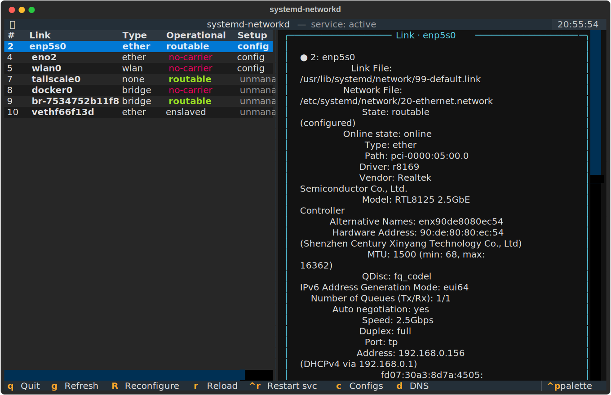

# networkd-tui

A terminal UI for **systemd-networkd** (and **systemd-resolved**), built with
[Textual](https://textual.textualize.io/). It's a thin, pretty front-end over
`networkctl` / `resolvectl` that operates on the declarative configs in
`/etc/systemd/network/`.

Read-only views need no privileges. Edits, reload, reconfigure and restart use
`sudo` (passwordless sudo recommended, otherwise run from a terminal where you
can authenticate).



## Features

- Live list of managed links with color-coded operational/setup state.
- Per-link status detail (updates as you move the cursor).
- Browse and **edit** `/etc/systemd/network/*.network|.netdev|.link` via
  `networkctl edit` (validates and offers to reload).
- Scaffold a **new `.network`** file (DHCP or static) from a small form.
- **Reconfigure** a link, **reload** networkd, or **restart** the service.
- **DNS** view (`resolvectl status`).

## Keys

| Key | Action |
|-----|--------|
| `q` / `Esc` | Quit |
| `g` | Refresh |
| `Enter` | Full status of selected link |
| `R` | Reconfigure selected link |
| `r` | Reload networkd |
| `Ctrl+R` | Restart `systemd-networkd` |
| `c` | Config files browser (edit / new) |
| `d` | DNS status (resolved) |

## Install

```bash
./install.sh
```

Creates a venv at `~/.local/share/networkd-tui`, installs Textual, drops a
launcher at `~/.local/bin/networkd-tui`, and installs a desktop entry (on
Omarchy it launches via `omarchy-launch-tui`; elsewhere it opens in a
terminal). Then just run:

```bash
networkd-tui
```

…or launch "Networkd TUI" from your app launcher.

Uninstall with `./install.sh --uninstall`.

## License

[MIT](LICENSE) © Alberto Linard
